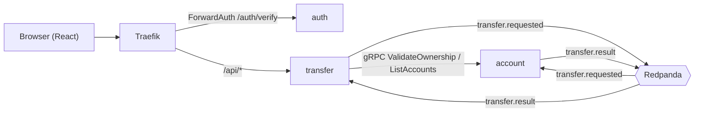

# CLAUDE.md

Guidance for Claude Code when working in this repository. Read `README.md` and `docs/README.md` first for full context.

## What this is

FastTrans — a demo money-transfer system. Event-driven messaging (Redpanda/Kafka) + synchronous gRPC across 3 Java Spring Boot services, fronted by a React/Vite SPA. Everything runs via `docker compose`.

## Architecture



- **gRPC (sync)**: transfer → account for ownership validation + account listing.
- **Redpanda (async)**: debit/credit + result, using Transactional Outbox (produce) + Inbox dedup (consume) on both sides.
- **Traefik ForwardAuth**: every transfer request passes through auth `/auth/verify` (Redis session check), which injects `X-User-Id`.

## Services

| Service  | Path                | Interfaces                                     | DB                                                                  |
| -------- | ------------------- | ---------------------------------------------- | ------------------------------------------------------------------- |
| auth     | `services/auth`     | REST (login, verify) + Redis sessions          | `auth_db` (users)                                                   |
| transfer | `services/transfer` | REST + gRPC client + Kafka producer/consumer   | `transfer_db` (transfers, outbox, processed_messages)               |
| account  | `services/account`  | gRPC server + Kafka consumer/producer, no REST | `account_db` (accounts, ledger_entries, outbox, processed_messages) |
| frontend | `frontend`          | React SPA served via Traefik                   | —                                                                   |

Each Java service is a standalone Maven module (`com.fasttrans.*`, Java 21, Spring Boot 3.3.4). Package layout follows Clean Architecture / DDD with 3 layers:

- **domain/** — `entities/` (pure POJO business objects), `interfaces/` (repository + external-service contracts), `exception/` (domain exceptions)
- **application/** — `dto/` (request/response + event payload DTOs), `services/` (@Service orchestration, @Transactional boundary)
- **infrastructure/** — grouped by tech: `web/` (REST controller), `grpc/` (server/client), `messaging/` (Kafka), `persistence/` (JpaEntity, SpringDataRepository, MapStruct), `config/`, `security/` (JWT), `session/` (Redis)

Dependency rule enforced by ArchUnit: `infrastructure → application → domain`; domain is framework-free. See [CleanArchitectureTest](services/*/src/test/java/com/fasttrans/*/CleanArchitectureTest.java) in each service.

## Build & run

```bash
docker compose up --build      # build all, wait until healthy
docker compose down -v         # stop + reset state (removes volumes, re-seeds)
bash scripts/e2e-smoke.sh      # end-to-end smoke test
```

Per-service build (from inside a service dir): `mvn clean package`. gRPC stubs are generated by `protobuf-maven-plugin` from `proto/account.proto` at build time.

Frontend (uses **pnpm**, from `frontend/`):

```bash
pnpm install
pnpm dev              # vite dev server
pnpm build            # tsc + vite build
pnpm generate:api     # orval — regenerate typed API client from OpenAPI
```

OpenAPI merge for the FE client: `scripts/gen-openapi.sh` → `scripts/merge-openapi.mjs` → `docs/openapi.yaml`.

## Conventions

- **Money**: stored as `bigint` in smallest unit (VND: 1 = 1 dong). Never use floats for amounts.
- **Account identity**: public `accountRef` (12-digit) in APIs/events; internal UUIDs only inside `account_db`.
- **Idempotency**: transfers require an `Idempotency-Key` header; consumers dedup via `processed_messages` (Inbox).
- **DB migrations**: Flyway, one concern per file, named `V<timestamp>__<description>.sql` under `src/main/resources/db/migration`. Do not edit an applied migration — add a new one.
- **FE API client** in `src/api/generated/` is generated by orval (react-query + zod). Do not hand-edit; regenerate with `pnpm generate:api`.
- **account service** intentionally avoids `spring-boot-starter-web` (MVC) — it only uses WebFlux for the actuator health endpoint. Keep it REST-free.
- File naming: kebab-case for TS/shell; Java/SQL follow their language conventions.

## Contracts (source of truth)

- Events: `docs/events/transfer-events.md`
- DB schema + seed: `docs/db/schema.md`
- gRPC proto: `proto/account.proto`
- Diagrams: `docs/diagrams.md`

## Notes

- Plans live under `plans/`, docs under `docs/`. Do not create markdown elsewhere unless asked.
- Seed users: `alice` / `bob`, password `password` (see README for accounts/balances).
- This is a demo: Traefik dashboard and some settings are insecure by design. Don't harden without being asked.
