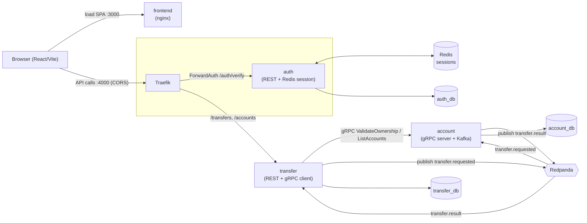
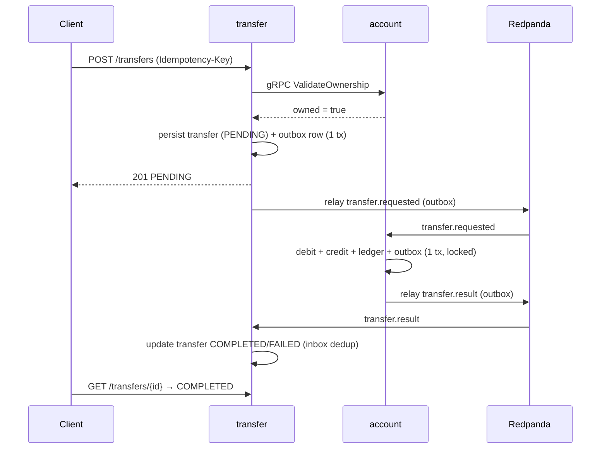
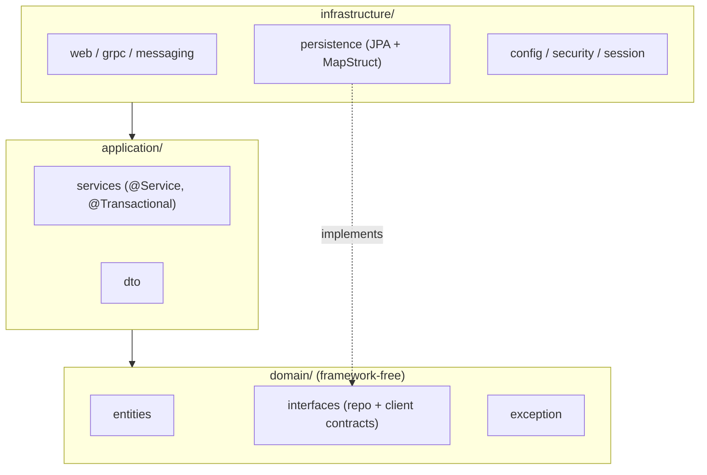

# FastTrans — Demo Transfer System (Java Spring Boot Microservices)

A demo money-transfer system using event-driven messaging + synchronous gRPC. 3 Java services (auth, transfer, account) + a React/Vite FE, all run via `docker compose`.

## Architecture overview



- **Frontend origin**: the SPA is served by its own nginx on `:3000` and calls the API cross-origin at Traefik `:4000`. Traefik applies a CORS middleware (before ForwardAuth) so browser preflights succeed.
- **gRPC (sync)**: transfer → account — validate ownership when creating a transfer + list accounts.
- **Redpanda (async)**: transfer ↔ account — debit/credit + result (Transactional Outbox + Inbox dedup).
- **Traefik ForwardAuth**: every request to transfer goes through auth `/auth/verify`, which injects `X-User-Id`.

### Money transfer flow



### Clean Architecture (per Java service)

Each Java service (`auth`, `transfer`, `account`) follows a 3-layer Clean Architecture / DDD layout, enforced by ArchUnit (`infrastructure → application → domain`; domain is framework-free).



## Run

```bash
docker compose up --build      # build everything; wait until all healthy
docker compose down -v         # stop + remove volumes (reset state cleanly)
```

Open the app at **http://localhost:3000** (FE); the SPA calls the API at **http://localhost:4000** (Traefik).

## Ports

| Service           | Port (host) | Note                              |
| ----------------- | ----------- | --------------------------------- |
| Frontend (nginx)  | 3000        | React SPA (calls the API at 4000) |
| Traefik           | 4000        | API gateway (`/auth`, `/transfers`, `/accounts`) |
| Traefik dashboard | 8081        | Demo only (insecure)              |
| Postgres          | 15432       | user/pass `fasttrans`; 3 dbs      |
| Redis             | 6379        | auth session store                |
| Redpanda          | 19092       | Kafka API (host); 29092 internal  |
| account           | 9090        | gRPC internal (no HTTP exposed)   |

Host ports are remapped to avoid conflicts with local processes (Traefik `4000`, Postgres `15432`, Redpanda `19092`); containers still talk to each other on the standard internal ports (`80`/`5432`/`29092`). If a host port is still taken → edit only the host side (left of the `:`) in the `ports:` mapping in `docker-compose.yml`.

## Seed data

| User  | Password   | Account ref    | Balance (VND) |
| ----- | ---------- | -------------- | ------------- |
| alice | `password` | `100000000001` | 1,000,000     |
| alice | `password` | `100000000002` | 50,000        |
| bob   | `password` | `200000000001` | 0             |

Money is stored as `bigint` in the smallest unit (VND: 1 = 1 dong). Accounts are referenced by `accountRef` (12-digit public), while UUIDs are used only internally in account_db.

## API (qua Traefik `:4000`)

Every REST response is enveloped: success → `{ data, meta }`, error → `{ error: { code, message, details? }, meta }` (HTTP status stays truthful). `meta` carries `{ requestId, timestamp }` where `requestId` is the traceId. `/auth/verify` is header-only (not enveloped).

| Method | Path              | Auth        | Description                                  |
| ------ | ----------------- | ----------- | -------------------------------------------- |
| POST   | `/auth/login`     | —           | `{username,password}` → `{ data: { token } }` |
| GET    | `/auth/verify`    | Bearer      | ForwardAuth endpoint (internal)              |
| GET    | `/accounts`       | ForwardAuth | list the user's accounts (gRPC)              |
| POST   | `/transfers`      | ForwardAuth | create a transfer (`Idempotency-Key` header) |
| GET    | `/transfers`      | ForwardAuth | list the user's transfers                    |
| GET    | `/transfers/{id}` | ForwardAuth | detail of a single transfer                  |

## Contracts

- Event schema: [docs/events/transfer-events.md](docs/events/transfer-events.md)
- DB schema + seed: [docs/db/schema.md](docs/db/schema.md)
- gRPC proto: [proto/account.proto](proto/account.proto)
- Docs index: [docs/README.md](docs/README.md)

## Demo walkthrough

Run automatically:

```bash
bash scripts/e2e-smoke.sh
```

Or manually:

```bash
# Every REST response is enveloped: success → { data, meta }, error → { error, meta }.
# Read the payload from `.data` (the examples below unwrap it with jq).

# 1. Login to get a token
TOKEN=$(curl -sf -X POST http://localhost:4000/auth/login \
  -H "Content-Type: application/json" \
  -d '{"username":"alice","password":"password"}' | jq -r '.data.token')

# 2. List accounts (gRPC ListAccounts)
curl -s http://localhost:4000/accounts \
  -H "Authorization: Bearer $TOKEN" | jq .

# 3. Create a transfer (fromAccountRef must belong to alice)
curl -s -X POST http://localhost:4000/transfers \
  -H "Authorization: Bearer $TOKEN" \
  -H "Idempotency-Key: $(python3 -c 'import uuid; print(uuid.uuid4())')" \
  -H "Content-Type: application/json" \
  -d '{"fromAccountRef":"100000000001","toAccountRef":"200000000001","amount":50000,"currency":"VND"}' | jq .

# 4. Poll the detail until COMPLETED/FAILED
curl -s http://localhost:4000/transfers/<id> \
  -H "Authorization: Bearer $TOKEN" | jq .

# 5. Inspect the ledger directly (after docker compose up)
docker compose exec postgres psql -U fasttrans -d account_db \
  -c "SELECT account_id, direction, amount, balance_after FROM ledger_entries ORDER BY created_at;"

# 6. Check that balances match the ledger
docker compose exec postgres psql -U fasttrans -d account_db \
  -c "SELECT a.account_ref, a.balance,
             SUM(CASE l.direction WHEN 'CREDIT' THEN l.amount ELSE -l.amount END) AS ledger_sum
      FROM accounts a
      LEFT JOIN ledger_entries l ON l.account_id = a.id
      GROUP BY a.id, a.account_ref, a.balance;"
```

## Testing & CI

Each Java service ships unit tests (`*Test`, Surefire — includes ArchUnit layer checks) and integration tests (`*IT`, Failsafe — Testcontainers: Postgres/Redpanda/Redis). A JaCoCo gate enforces **≥90% LINE** coverage per service at `mvn verify` (current: auth 97.3%, transfer 99.1%, account 95.4%).

```bash
# From a service dir (services/auth|transfer|account) — Docker required for *IT
mvn clean verify              # unit + integration + coverage gate
mvn verify -DskipITs          # fast, unit-only (no Docker)
```

GitHub Actions (`.github/workflows/ci.yml`) runs on push/PR to `main`:

- **backend** (matrix: auth, transfer, account) — `mvn verify` (unit + integration + coverage gate); Testcontainers uses the Docker preinstalled on `ubuntu-latest`.
- **frontend** — `tsc --noEmit` typecheck (no ESLint configured) + `pnpm build`.

## Troubleshooting

**Redpanda not healthy at boot:** `redpanda-init` waits for `service_healthy` — if topic creation fails, rerun it:

```bash
docker compose restart redpanda-init
```

**Dirty state between test runs:**

```bash
docker compose down -v   # remove all volumes; the next up re-seeds from scratch
```

**account service slow to start (gRPC not ready yet):** transfer uses `depends_on account: condition: service_healthy`; the actuator health check on port 8080 uses WebFlux (Netty). start_period is 60s — enough for Flyway migration + JVM warm-up.

**Port conflict:** if `4000`/`15432`/`19092` is taken → edit the `ports:` mapping in `docker-compose.yml`, changing only the host side (left of the `:`).

**Outbox stuck at PENDING:** check the relay logs:

```bash
docker compose logs account | grep -i "relay\|outbox"
docker compose logs transfer | grep -i "relay\|outbox"
```

**Token expired / revoked (Redis flush):** log in again to get a new token.
