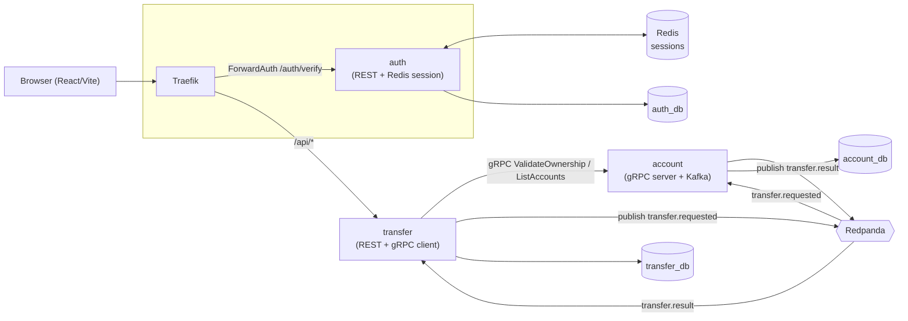
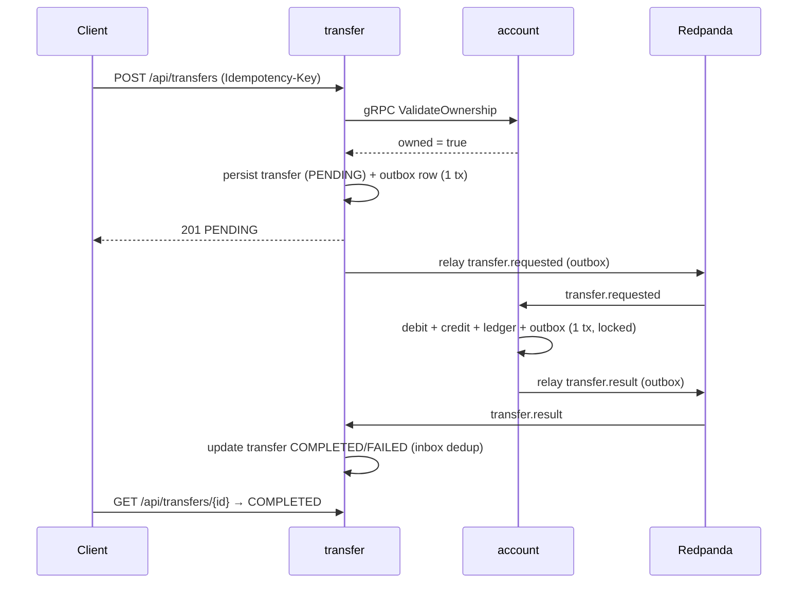
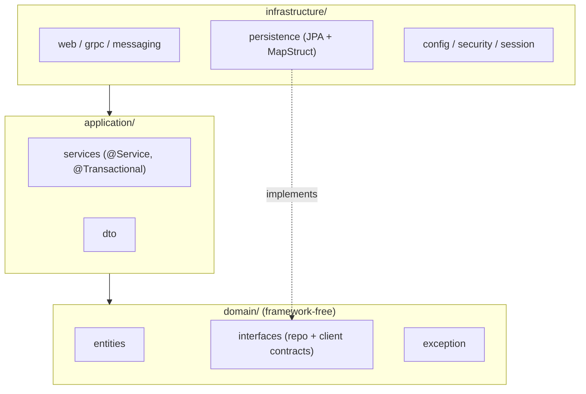

# FastTrans — Demo Transfer System (Java Spring Boot Microservices)

A demo money-transfer system using event-driven messaging + synchronous gRPC. 3 Java services (auth, transfer, account) + a React/Vite FE, all run via `docker compose`.

## Architecture overview



- **gRPC (sync)**: transfer → account — validate ownership when creating a transfer + list accounts.
- **Redpanda (async)**: transfer ↔ account — debit/credit + result (Transactional Outbox + Inbox dedup).
- **Traefik ForwardAuth**: every request to transfer goes through auth `/auth/verify`, which injects `X-User-Id`.

### Money transfer flow



### Clean Architecture (per Java service)

Each Java service (`auth`, `transfer`, `account`) follows a 3-layer Clean Architecture / DDD layout, enforced by ArchUnit (`infrastructure → application → domain`; domain is framework-free).



## Run

```bash
docker compose up --build      # build everything; wait until all healthy
docker compose down -v         # stop + remove volumes (reset state cleanly)
```

## Ports

| Service           | Port (host) | Note                             |
| ----------------- | ----------- | -------------------------------- |
| Traefik           | 80          | Gateway, all `/api/*` + FE `/`   |
| Traefik dashboard | 8081        | Demo only (insecure)             |
| Postgres          | 5432        | user/pass `fasttrans`; 3 dbs     |
| Redis             | 6379        | auth session store               |
| Redpanda          | 9092        | Kafka API (host); 29092 internal |
| account           | 9090        | gRPC internal (no HTTP exposed)  |

If port `80`/`5432`/`9092` is taken by a local process → edit the `ports:` mapping in `docker-compose.yml`.

## Seed data

| User  | Password   | Account ref    | Balance (VND) |
| ----- | ---------- | -------------- | ------------- |
| alice | `password` | `100000000001` | 1,000,000     |
| alice | `password` | `100000000002` | 50,000        |
| bob   | `password` | `200000000001` | 0             |

Money is stored as `bigint` in the smallest unit (VND: 1 = 1 dong). Accounts are referenced by `accountRef` (12-digit public), while UUIDs are used only internally in account_db.

## API (qua Traefik `/api`)

| Method | Path                  | Auth        | Description                                  |
| ------ | --------------------- | ----------- | -------------------------------------------- |
| POST   | `/api/auth/login`     | —           | `{username,password}` → `{token}`            |
| GET    | `/api/auth/verify`    | Bearer      | ForwardAuth endpoint (internal)              |
| GET    | `/api/accounts`       | ForwardAuth | list the user's accounts (gRPC)              |
| POST   | `/api/transfers`      | ForwardAuth | create a transfer (`Idempotency-Key` header) |
| GET    | `/api/transfers`      | ForwardAuth | list the user's transfers                    |
| GET    | `/api/transfers/{id}` | ForwardAuth | detail of a single transfer                  |

## Contracts

- Event schema: [docs/events/transfer-events.md](docs/events/transfer-events.md)
- DB schema + seed: [docs/db/schema.md](docs/db/schema.md)
- gRPC proto: [proto/account.proto](proto/account.proto)
- Docs index: [docs/README.md](docs/README.md)

## Demo walkthrough

Run automatically:

```bash
bash scripts/e2e-smoke.sh
```

Or manually:

```bash
# 1. Login to get a token
TOKEN=$(curl -sf -X POST http://localhost/api/auth/login \
  -H "Content-Type: application/json" \
  -d '{"username":"alice","password":"password"}' | jq -r '.token')

# 2. List accounts (gRPC ListAccounts)
curl -s http://localhost/api/accounts \
  -H "Authorization: Bearer $TOKEN" | jq .

# 3. Create a transfer (fromAccountRef must belong to alice)
curl -s -X POST http://localhost/api/transfers \
  -H "Authorization: Bearer $TOKEN" \
  -H "Idempotency-Key: $(python3 -c 'import uuid; print(uuid.uuid4())')" \
  -H "Content-Type: application/json" \
  -d '{"fromAccountRef":"100000000001","toAccountRef":"200000000001","amount":50000,"currency":"VND"}' | jq .

# 4. Poll the detail until COMPLETED/FAILED
curl -s http://localhost/api/transfers/<id> \
  -H "Authorization: Bearer $TOKEN" | jq .

# 5. Inspect the ledger directly (after docker compose up)
docker compose exec postgres psql -U fasttrans -d account_db \
  -c "SELECT account_id, direction, amount, balance_after FROM ledger_entries ORDER BY created_at;"

# 6. Check that balances match the ledger
docker compose exec postgres psql -U fasttrans -d account_db \
  -c "SELECT a.account_ref, a.balance,
             SUM(CASE l.direction WHEN 'CREDIT' THEN l.amount ELSE -l.amount END) AS ledger_sum
      FROM accounts a
      LEFT JOIN ledger_entries l ON l.account_id = a.id
      GROUP BY a.id, a.account_ref, a.balance;"
```

## Troubleshooting

**Redpanda not healthy at boot:** `redpanda-init` waits for `service_healthy` — if topic creation fails, rerun it:

```bash
docker compose restart redpanda-init
```

**Dirty state between test runs:**

```bash
docker compose down -v   # remove all volumes; the next up re-seeds from scratch
```

**account service slow to start (gRPC not ready yet):** transfer uses `depends_on account: condition: service_healthy`; the actuator health check on port 8080 uses WebFlux (Netty). start_period is 60s — enough for Flyway migration + JVM warm-up.

**Port conflict:** if `80`/`5432`/`9092` is taken → edit the `ports:` mapping in `docker-compose.yml`, changing only the host side (left of the `:`).

**Outbox stuck at PENDING:** check the relay logs:

```bash
docker compose logs account | grep -i "relay\|outbox"
docker compose logs transfer | grep -i "relay\|outbox"
```

**Token expired / revoked (Redis flush):** log in again to get a new token.
