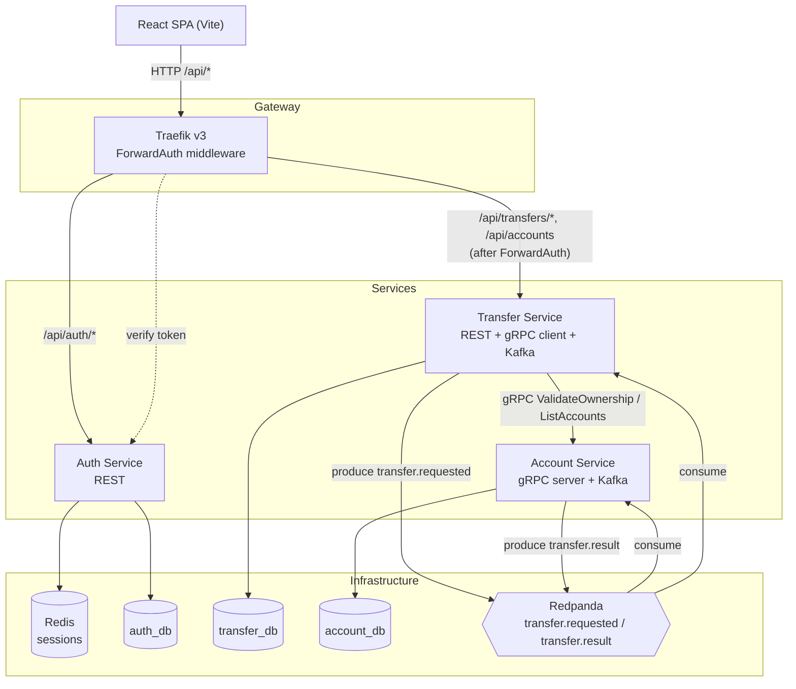
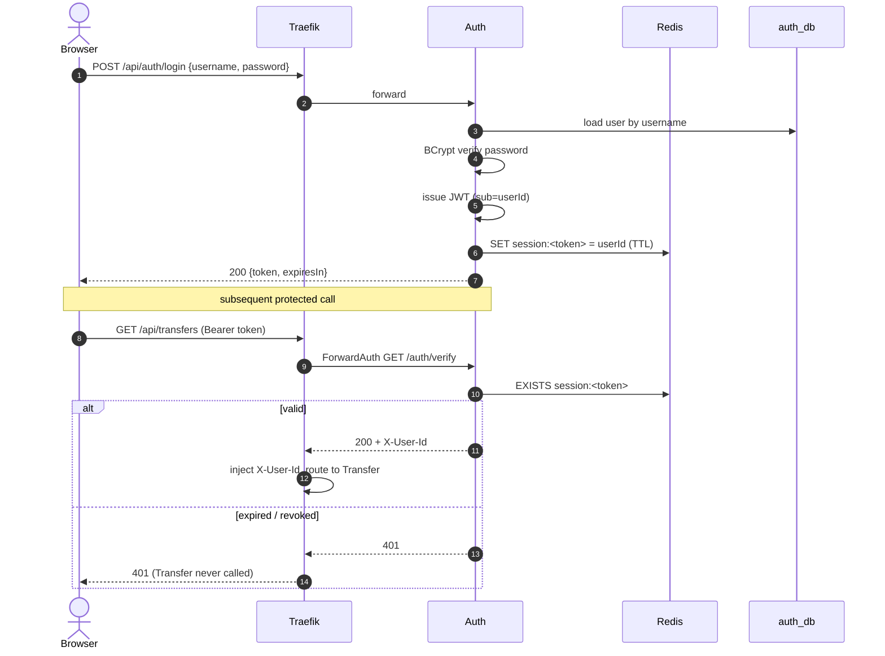
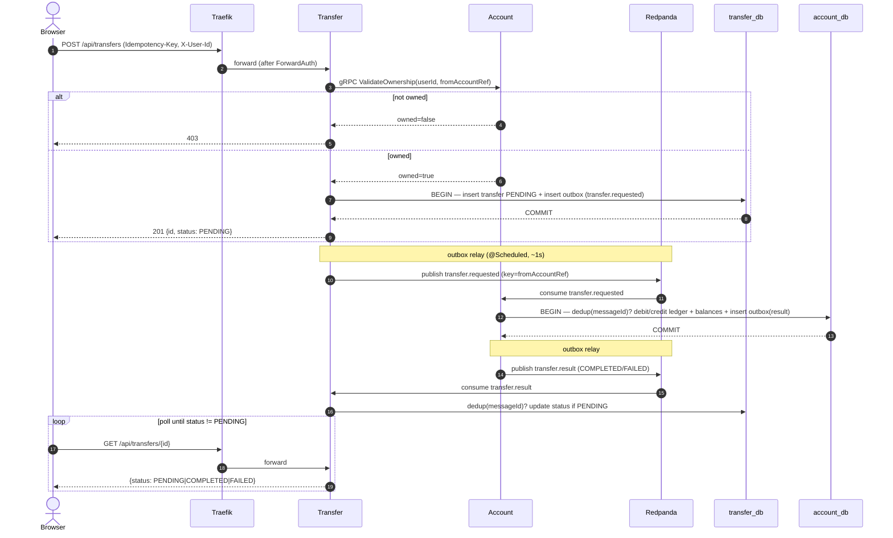
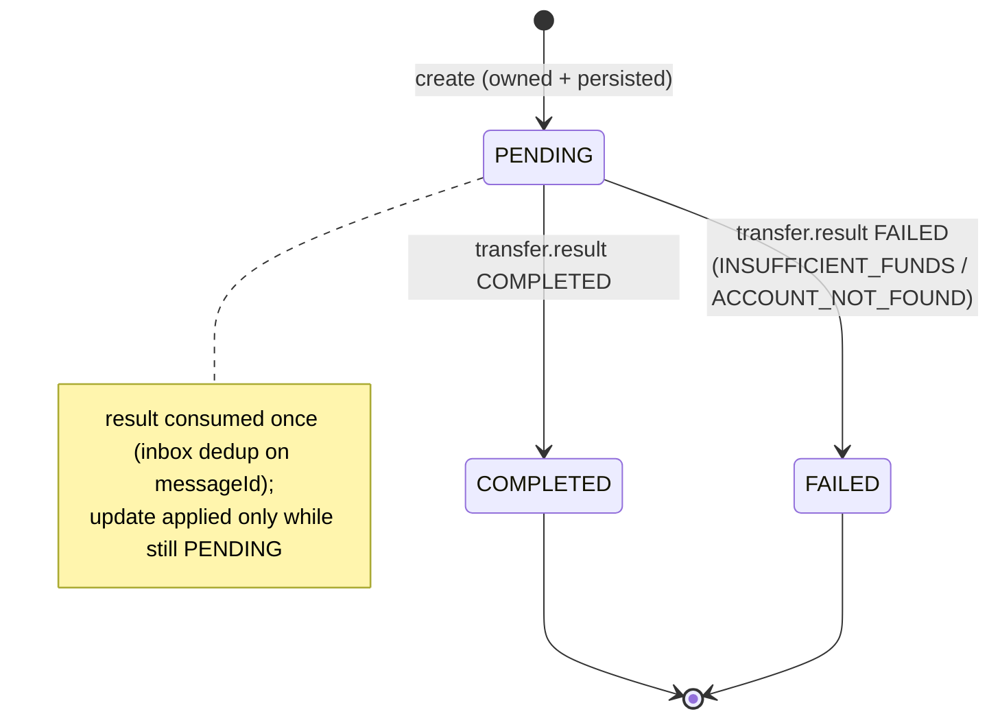
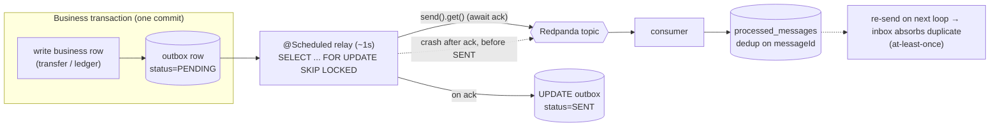
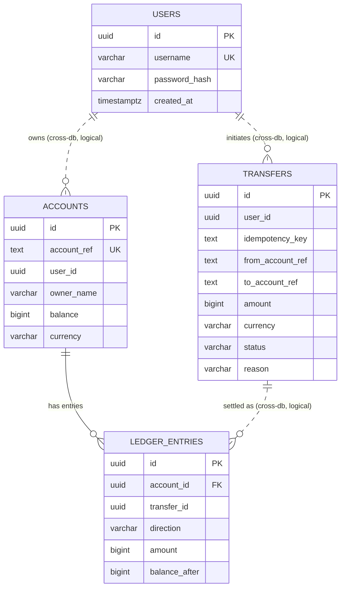

# Diagrams

Mermaid diagrams for the transfer system. Renders on GitHub and any Mermaid-aware viewer.

- Plan: [../plans/260703-1537-java-microservices-transfer-demo/plan.md](../plans/260703-1537-java-microservices-transfer-demo/plan.md)
- Services: [auth](services/auth-service.md) · [transfer](services/transfer-service.md) · [account](services/account-service.md) · [frontend](services/frontend.md)

## 1. System architecture (C4-ish container view)

## 2. Login & token verification

## 3. Create transfer — sync validate + async settlement

## 4. Transfer status lifecycle

## 5. Transactional Outbox relay (polling, not CDC)

## 6. Data model (per-service databases)

Dashed relations are cross-database logical links (no physical FK across service DBs). `transfers.(user_id, idempotency_key)` is UNIQUE for API idempotency. Both transfer_db and account_db also hold `outbox` and `processed_messages` (omitted above for clarity — see [db/schema.md](db/schema.md)).
